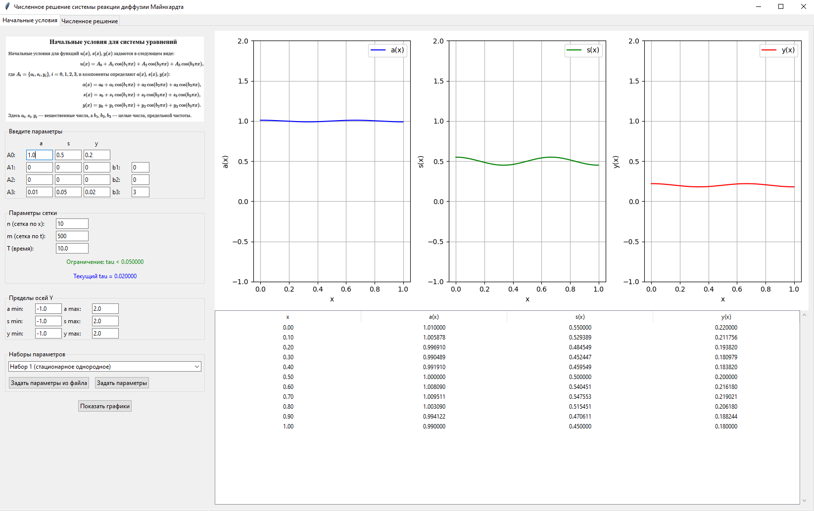
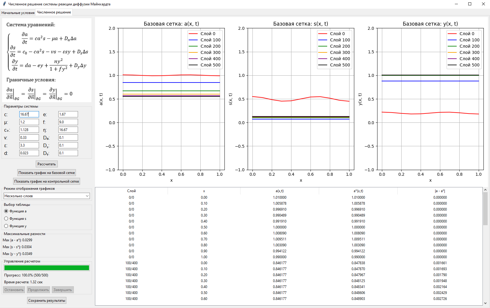
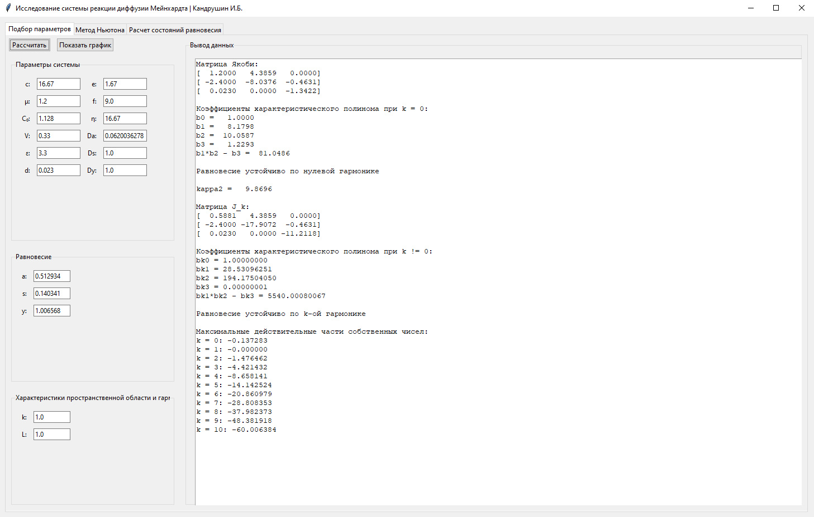
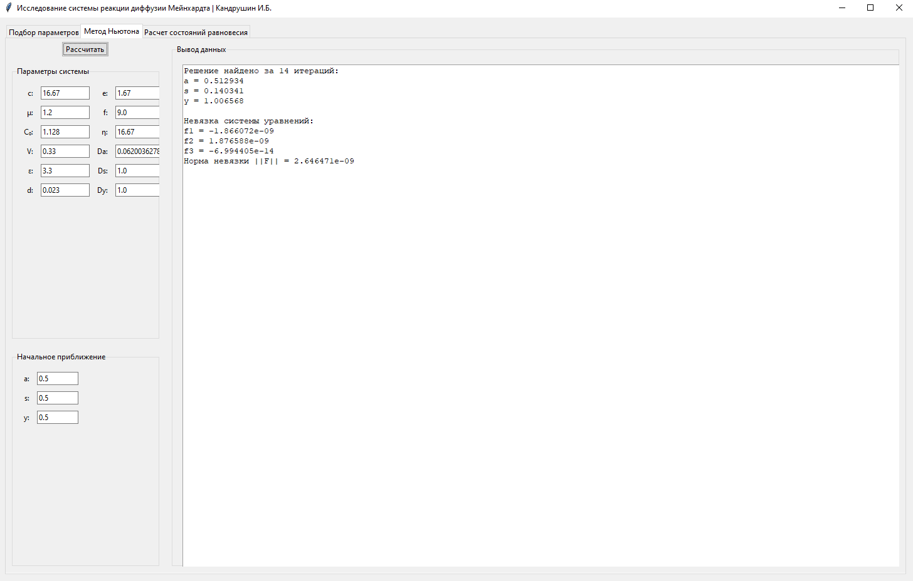
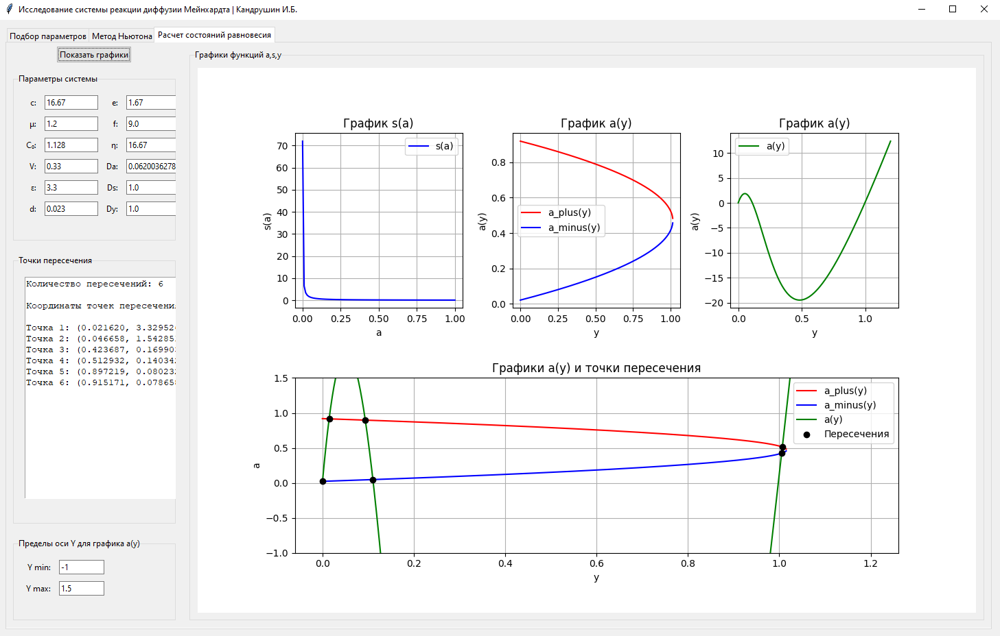

# Программный комплекс для аналитического и численного исследования модели реакции-диффузии Мейнхардта

[](https://github.com/ilya-kan07/meinhardt-reaction-diffusion/actions/workflows/tests.yml)
[](https://python.org)
[](LICENSE)

## Описание

Программный комплекс состоит из **двух независимых программ**, направленных на изучение диссипативных структур в системе уравнений химической кинетики(модель Мейнхардта):
    1. Программа 1 для численного решения системы уравнений с использованием **явной конечно-разностной схемы**.
    2. Программа 2 для аналитического исследования системы.

В программе 1 реализован следующий функционал:
- Разделение функционала программы на две связанные вкладки: *Начальные условия* и *Численное решение*.
- Вкладка *Начальные условия* имеет следующий функционал:
    - Задание начальных условий в виде суммы косинусов трех гармоник.
    - Задание параметров сетки, пределов осей, возможность задавать предустановленные в программе значения      параметров или задавать параметры из файла.
    - Проверка корректности введенных данных и соблюдений условия утойчивости численного метода.
    - Табличная и графическая визуализация результатов вычисления начальных условий.
- Вкладка *Численное решение* включает в себя:
    - Ввод параметров системы
    - Расчет численного решения системы уравнений на базовой сетке(*n* узлов по пространству, *m* слоев по времени) и контрольной сетке(*2n* узлов по пространству, *4m* слоев по времени).
    - Табличное и графическое представление результатов вычисления для каждого реагента *a, s, y*.
    - Возможность выбора режима отображения: "последний слой" и "несколько слоев".
    - Управление расчетом: приостановка, продолжение или завершение вычислений на любом слое.
    - Прогресс-бар для отслеживания процесса выполнения численного расчета.
    - Анализ точности численного решения посредством вычисления максимальных разностей между решениями на базовой и контрольной сетках.
    - Сохранение результатов расчетов в указанную пользователем директорию.

Программа 2 представляет собой объединение трех связанных вкладок:
- Вкладка *Подбор параметров* предназначена для отыскания значений параметров системы, при которых система принимает состояния возникновения диссипативных структур, в том числе, структур Тьюринга.
- Вкладка *Метод Ньютона* предназначена для численного нахождения однородных стационарных решений системы нелинейных алгебраических уравнений, описывающих равновесие системы, с использованием метода Ньютона.
- Вкладка *Расчет состояний равновесия* предназначена для визуализации и анализа решений системы нелинейных алгебраических уравнений, описывающих равновесие системы, путем построения графиков зависимостей *a,s,y* и нахождения их точек пересечения.

## Особенности

- **Две независимые программы** в одном репозитории (monorepo)
- **Явная схема с контролем Куранта** → гарантированная устойчивость
- **2D визуализация** с анимацией слоёв
- **Метод Ньютона** с известной точкой бифуркации
- **Unit-тесты + CI/CD** (GitHub Actions)
- **PyInstaller .exe** (в релизе)

## Демо

### Численное решение

| Вкладка | Описание |
|--------|---------|
|  | Задание косинусов, проверка устойчивости |
|  | 2D поле, прогресс-бар, экспорт |

### Анализ устойчивости

| Вкладка | Описание |
|--------|---------|
|  | Устойчивость |
|  | Поиск равновесия |
|  | Нулклины, точки пересечения |

## Установка

```bash
# 1. Клонируем репозиторий
git clone https://github.com/ilya-kan07/meinhardt-reaction-diffusion.git
cd meinhardt-reaction-diffusion

# 2. Создаём и активируем виртуальное окружение
python -m venv venv
source venv/bin/activate    # Linux / macOS
# или
venv\Scripts\activate       # Windows

# 3. Устанавливаем зависимости
pip install --upgrade pip
pip install -r requirements.txt
```

## Запуск

```bash
# Численное решение
python run_solver.py

# Анализ
python run_analysis.py
