# Руководство пользователя

## 1. Численное решение (`run_solver.py`)

### Вкладка: **Начальные условия**

| Элемент интерфейса | Описание |
|--------------------|-----------|
| 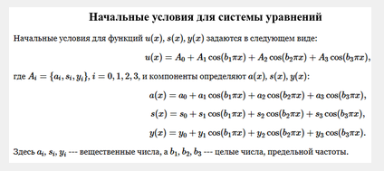| Картинка с видом представления начальных условий для системы |
| 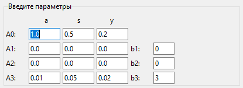 | Область для задания параметров начальных условий |
| 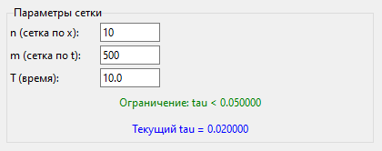 | Область для задания параметров сетки, ограничение на шаг по условию Куранта |
| 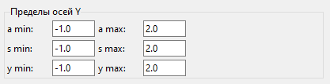 | Область для задания пределов осей для a,s,y |
| 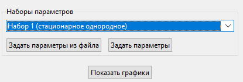 | Область для выбора предустановленных наборов параметров(для стационарного однородного решения и стационарного неоднородного), кнопки для задания параметров и показа графиков начальных условий |
| 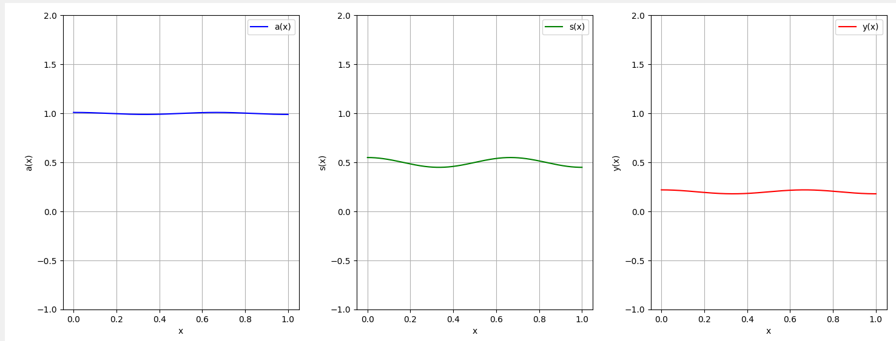 | Графическое представление начальных условий для функций a,s,y |
| 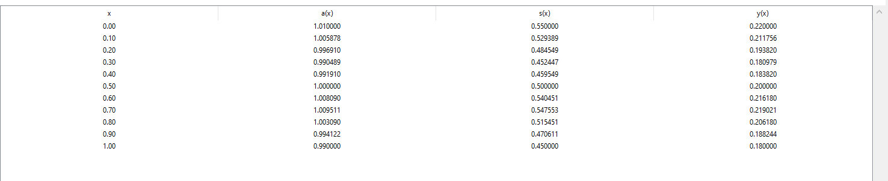 | Табличное представление начальных условий |

### Вкладка: **Численное решение**

| Элемент интерфейса | Описание |
|--------------------|-----------|
| 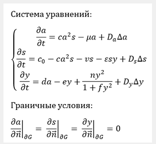| Картинка с видом системы уравнений |
| 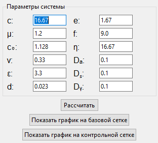 | Область для задания параметров системы, кнопки для проведения расчетов и показа графиков на базовой или контрольной сетках|
| 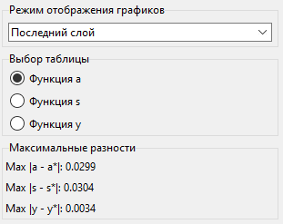 | Область для задания режима отображения(последний слой, несколько слоев), выбора функции для отображения данных в таблице, представление максимальных разностей для каждой функции |
| 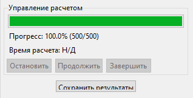 | Прогресс-бар отображающий степень завершенности расчета в процентах, время расчета, кнопки для приостановки, продолжения, завершения расчета, кнопка для сохранения результатов в указанную пользователем директорию |
| 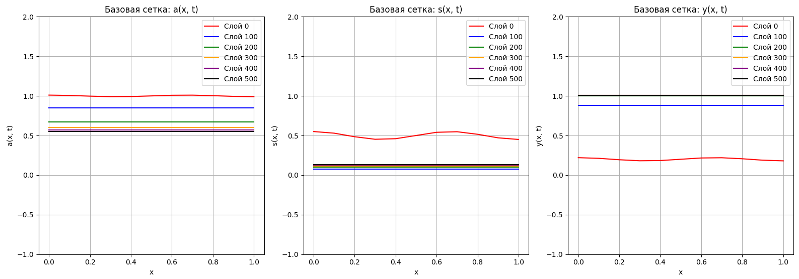 | Графическое представление результатов численных расчетов для каждой функции на нескольких слоях (6 слоев, включая нулевой) |
| 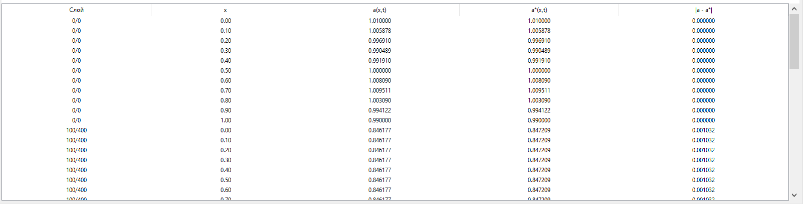 | Табличное представление результатов расчетов на базовой и контрольной сетках |
